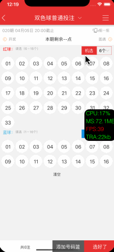

<p align="center" >

</p>

## Features

-  An UIButton custom class

## Requirements
- iOS 7.0 or later
- tvOS 9.0 or later
- watchOS 2.0 or later
- OS X 10.8 or later
- Xcode 8.0 or later

## Getting Started
- Read this Readme doc
- Read the [How to use section](https://github.com/xiayuqingfeng/DPAppDoctor#how-to-use)
- Read the [documentation @ CocoaDocs](https://cocoapods.org/pods/DPAppDoctor)
- Try the example by downloading the project from Github or even easier using CocoaPods try `pod try DPAppDoctor`
- Get to the [installation steps](https://github.com/rs/DPAppDoctor#installation)

## Who Uses It
- Find out [who uses DPAppDoctor](https://github.com/xiayuqingfeng/DPAppDoctor/wiki/Who-Uses-DPAppDoctor) and add your app to the list.

## Communication
- If you **need help**, use [Stack Overflow](http://stackoverflow.com/questions/tagged/DPAppDoctor). (Tag 'DPAppDoctor')
- If you'd like to **ask a general question**, use [Stack Overflow](http://stackoverflow.com/questions/tagged/DPAppDoctor).
- If you **found a bug**, open an issue.
- If you **have a feature request**, open an issue.
- If you **want to contribute**, submit a pull request.

## How To Use

```objective-c
Objective-C:

#import <CustomImageTextButton.h>
...
- (IBAction)makeButton:(id)sender {
    [sectionTitleButton removeFromSuperview];
    sectionTitleButton = nil;
    
    CGRect newFram = CGRectMake(30, 30, _widthField.text.floatValue, _heightField.text.floatValue);
    UIEdgeInsets newEdgeInsets = UIEdgeInsetsMake(_topField.text.floatValue, _leftField.text.floatValue, _bottomField.text.floatValue, _rightField.text.floatValue);
    
    sectionTitleButton = [DPButton buttonWithFrame:newFram imageTextType:[self getLayoutType] gap:_gapField.text.floatValue normalImage:_currentImage.image heightImage:_currentImage.image selectedImage:_currentImage.image text:_textStrField.text font:[UIFont systemFontOfSize:_textFontField.text.floatValue] textColor:[UIColor blackColor] heightTextColor:[UIColor blackColor] selectedTextColor:[UIColor blackColor] backGroundColor:[UIColor orangeColor] backGroundHightColor:[UIColor orangeColor] backGroundSelectedColor:[UIColor orangeColor] sideEdgeInsets:newEdgeInsets imageSize:CGSizeMake(_imageWidthField.text.floatValue, _imageHeightField.text.floatValue)];
    
    [self.view addSubview:sectionTitleButton];
    
    [sectionTitleButton setBackgroundColor:[UIColor clearColor]];
    sectionTitleButton.titleLabel.backgroundColor = [UIColor purpleColor];
    sectionTitleButton.imageView.backgroundColor = [UIColor redColor];
}

- (IBAction)updateButton:(id)sender {
    if (_widthField.text.floatValue != sectionTitleButton.frame.size.width || _heightField.text.floatValue != sectionTitleButton.frame.size.height) {
        sectionTitleButton.frame = CGRectMake(sectionTitleButton.frame.origin.x, sectionTitleButton.frame.origin.y, _widthField.text.floatValue, _heightField.text.floatValue);
    }
    
    if ([self getLayoutType] != sectionTitleButton.imageTextButtonType) {
        sectionTitleButton.imageTextButtonType = [self getLayoutType];
    }
    
    if (_gapField.text.floatValue != sectionTitleButton.imageTextGap) {
        sectionTitleButton.imageTextGap = _gapField.text.floatValue;
    }
    
    UIEdgeInsets newEdgeInsets = UIEdgeInsetsMake(_topField.text.floatValue, _leftField.text.floatValue, _bottomField.text.floatValue, _rightField.text.floatValue);
    if (!UIEdgeInsetsEqualToEdgeInsets(newEdgeInsets, sectionTitleButton.sideEdgeInsets)) {
        sectionTitleButton.sideEdgeInsets = newEdgeInsets;
    }
    
    if (![sectionTitleButton.deployText isEqualToString:_textStrField.text]) {
        sectionTitleButton.deployText = _textStrField.text;
    }
    
    if (sectionTitleButton.deployFont != [UIFont systemFontOfSize:_textFontField.text.floatValue]) {
        sectionTitleButton.deployFont = [UIFont systemFontOfSize:_textFontField.text.floatValue];
    }
    
    if (!CGSizeEqualToSize(sectionTitleButton.imageSize, CGSizeMake(_imageWidthField.text.floatValue, _imageHeightField.text.floatValue))) {
        sectionTitleButton.imageSize = CGSizeMake(_imageWidthField.text.floatValue, _imageHeightField.text.floatValue);
    }
    
    if (sectionTitleButton.imageName != _currentImage.image) {
        sectionTitleButton.imageName = _currentImage.image;
    }
    
    if (sectionTitleButton.heightImageName != _currentImage.image) {
        sectionTitleButton.heightImageName = _currentImage.image;
    }
    
    if (sectionTitleButton.selectedImageName != _currentImage.image) {
        sectionTitleButton.selectedImageName = _currentImage.image;
    }
}
...

```

Installation
------------

There are three ways to use DPAppDoctor in your project:
- using CocoaPods
- using Carthage
- by cloning the project into your repository

### Installation with CocoaPods

[CocoaPods](http://cocoapods.org/) is a dependency manager for Objective-C, which automates and simplifies the process of using 3rd-party libraries in your projects. See the [Get Started](http://cocoapods.org/#get_started) section for more details.

#### Podfile
```
platform :ios, '7.0'
pod 'DPAppDoctor', '~> 1.0.5'
```

If you are using Swift, be sure to add `use_frameworks!` and set your target to iOS 8+:
```
platform :ios, '8.0'
use_frameworks!
```

### Build Project
At this point your workspace should build without error. If you are having problem, post to the Issue and the
community can help you solve it.

## Collaborators
- [PingshengZhao(赵坪生)](https://github.com/PingshengZhao)

## Licenses
All source code is licensed under the [MIT License](https://github.com/xiayuqingfeng/DPAppDoctor/blob/master/LICENSE).

## Pictures show
<p align="center" >

</p>
